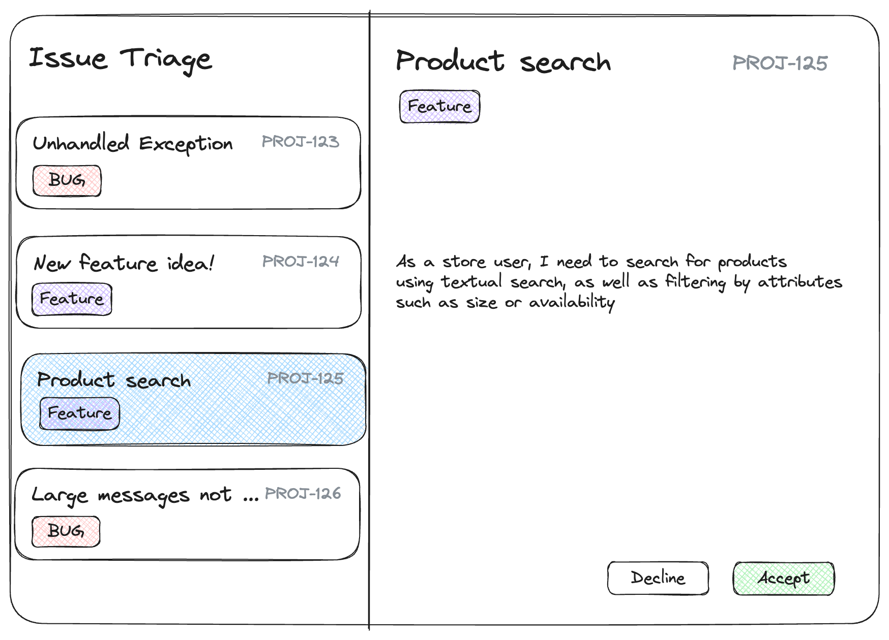

# `coding-challenge`
_Paired Programming Coding Challenge for Algomo Engineering Interviews_

Hi! Thank you for taking the time to complete our coding challenge. The objective is is to build an application for browsing conversations and messages, during a **_paired programming interview session_**

Depending on the role you have applied for, the focus will be full-stack or front-end focused. 

We want to understand how you work and get a view into your thought process/problem solving skills. As with all interviews this is a two-way street - it's also an opportunity for you to evaluate working with us! 🙂

## `tl;dr`

- The paired-programming session should take between 1 and 1.5 hours
  - Expect around 1 hour of coding, and up to 30 minutes at the end for technical questions
- We're not expecting you to develop the entire application within the timeslot!
  - It's up to you to decide how to break the problem into smaller features/what to build during the session
- We value fast iterations and tight feedback loops. The focus during the session should be building a usable feature

## Instructions

- [Fork](https://docs.github.com/en/pull-requests/collaborating-with-pull-requests/working-with-forks/fork-a-repo) this repository in GitHub
- Make sure you have VSCode installed, along with the [LiveShare](https://marketplace.visualstudio.com/items?itemName=MS-vsliveshare.vsliveshare) extension
- The back-end should be written using NodeJS/TypeScript, and the front-end using React
  - If you are more comfortable using other languages, please let us know before arranging the interview!
- **Before the interview, you should bootstrap your repository fork with a basic skaffold for the application**. For example, you could use:
  - Next.js or Vite for the front-end
  - For the back-end (if applicable) there are plenty of choices (Nest.js, Express, Koa, Fastify, just to name a few)
  - You may also choose a database, but it is completely fine to use stub data instead
  - You should include instructions on how to run the application (e.g. `docker-compose up`)

## Application Requirements

We want you to build an issue triaging board (think something along the lines of JIRA/Linear)

This application should consist of two main services: UI and Issue Management (back-end).

_If you are applying for a front-end role, you can ignore the back-end service and instead stub network requests._

Build an application with the following functionality (you may use the layout below for inspiration):

- Display a list of all Issues to be Triaged
- Filter the list of Issues
- View details for the selected Issue
- Accept or Decline Issues

## Final Thoughts

This exercise leaves you a fair amount of flexibility. This emulates the way we work. We are a dynamic start-up and a successful candidate will often have to deal with similar uncertainty.

Above all, we hope this test is enjoyable! We'd love to hear your feedback too.
